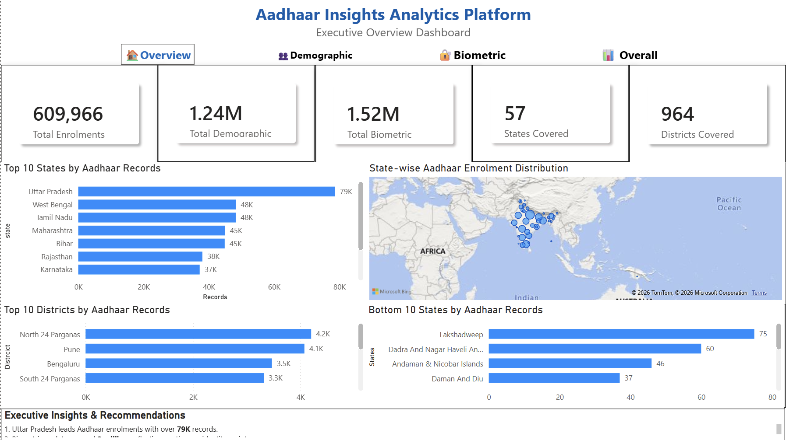
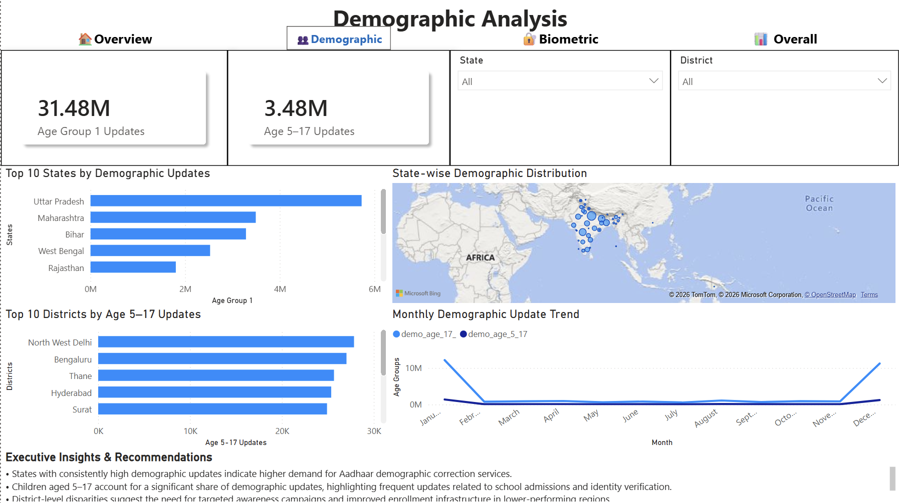
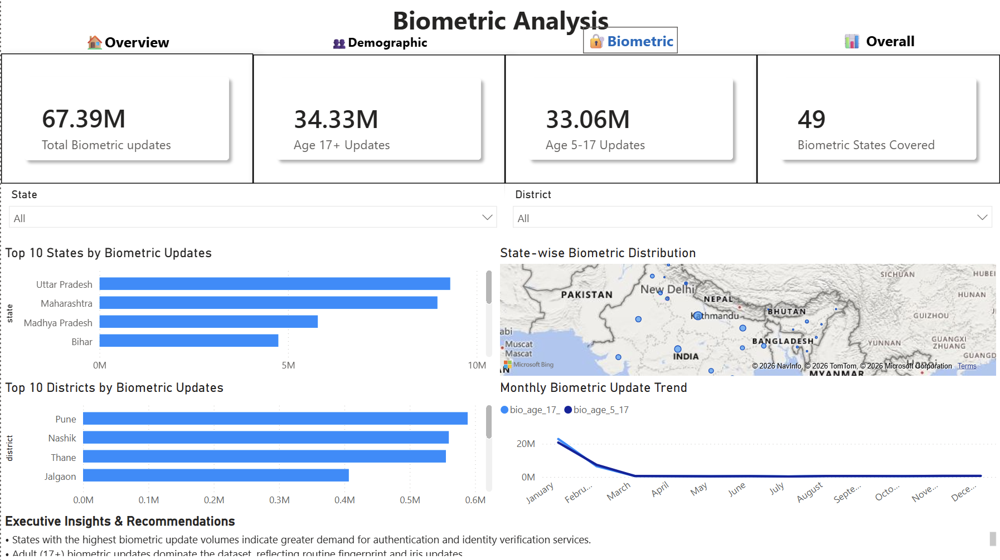
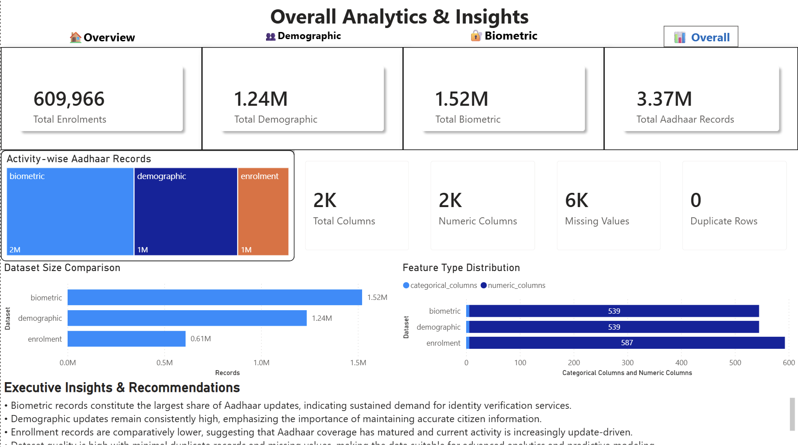

<div align="center">

# 🪪 Aadhaar Insights Analytics Platform

### Transforming Aadhaar Public Data into Actionable Insights using Data Analytics, Machine Learning & Interactive Dashboards

<p align="center">


</p>

### 📊 Analyze • Forecast • Detect • Visualize • Recommend

A complete end-to-end analytics platform built using **Python, Machine Learning, Streamlit, Plotly and Power BI** for analyzing India's Aadhaar enrolment and update datasets.

</div>

---

# 🌐 Live Demo

🚀 **Streamlit Application:** *Coming Soon*

📊 **Power BI Dashboard:** `dashboard/powerbi/Aadhaar_Insights_Dashboard.pdf`

---

# 📌 Project Overview

The **Aadhaar Insights Analytics Platform** is an end-to-end analytics solution that transforms large-scale Aadhaar enrolment, demographic update, and biometric update datasets into meaningful insights through advanced analytics and interactive visualizations.

The platform integrates:

- 📊 Interactive Business Analytics
- 📈 Trend Analysis
- 🤖 Machine Learning Forecasting
- 🚨 Anomaly Detection
- 📉 Correlation Analysis
- 📍 Regional Insights
- 💡 Automated Recommendation Engine
- 🌐 Interactive Streamlit Dashboard
- 📊 Power BI Executive Dashboard

This project demonstrates how public-sector datasets can be transformed into actionable intelligence for researchers, policymakers, analysts, and decision-makers.

---

# ✨ Features

## 📊 Interactive Dashboard

- Executive Overview
- KPI Cards
- Dynamic Filters
- Interactive Plotly Charts
- Multi-dataset Analysis
- Responsive User Interface

---

## 📈 Trend Analysis

- Year-wise Analysis
- Monthly Trends
- Quarterly Trends
- Weekend vs Weekday Analysis
- Regional Comparisons
- Growth Visualization

---

## 🤖 Machine Learning

Forecasting models implemented for:

- Aadhaar Enrolment
- Demographic Updates
- Biometric Updates

Models evaluated:

- Baseline Model
- Linear Regression
- Random Forest Regressor
- XGBoost Regressor

---

## 🚨 Anomaly Detection

Automatically detects:

- High-risk Regions
- Statistical Outliers
- Sudden Growth Spikes
- Unusual Update Patterns
- Severity Classification

---

## 📉 Correlation Analysis

Provides statistical relationships between important Aadhaar attributes using correlation matrices and interactive visualizations.

---

## 📍 Regional Analytics

- State Rankings
- District Rankings
- Top Performing States
- Lowest Performing States
- Geographic Insights

---

## 💡 Recommendation Engine

Automatically generates:

- Executive Summary
- Data-driven Recommendations
- Growth Opportunities
- Performance Evaluation
- Forecast Summary
- Strategic Insights

---

## 📊 Power BI Dashboard

Interactive business intelligence dashboard including:

- Executive KPIs
- State-wise Analysis
- District Analytics
- Geographic Visualizations
- Trend Monitoring

---

# 🖥️ Streamlit Pages

| Page | Description |
|------|-------------|
| 🏠 Home | Project overview and KPIs |
| 📊 Dashboard | Executive analytics dashboard |
| 📈 Trends | Trend analysis |
| 📉 Growth | Growth analytics |
| 🔗 Correlation | Correlation analysis |
| 🚨 Anomalies | Outlier detection |
| 🤖 Forecasting | Machine learning forecasts |
| 💡 Recommendations | Automated recommendations |
| ℹ️ About | Project information |

---

# 🏗️ Project Architecture

```text
                Raw Aadhaar Datasets
                        │
                        ▼
          Data Cleaning & Preprocessing
                        │
                        ▼
             Feature Engineering
                        │
                        ▼
               Analytics Engine
      ┌─────────┬─────────┬─────────┐
      ▼         ▼         ▼         ▼
     EDA    Forecast   Anomaly   Correlation
      │
      ▼
 Recommendation Engine
      │
      ▼
 Interactive Streamlit Dashboard
      │
      ▼
  Power BI Dashboard
```

---

# 📂 Repository Structure

```text
Aadhaar-Insights-Analytics-Platform
│
├── app/
│   ├── Home.py
│   ├── pages/
│   ├── assets/
│   └── components/
│
├── src/
│
├── data/
│   ├── processed/
│   ├── analytics/
│   └── forecasting/
│
├── dashboard/
│   ├── powerbi/
│   └── assets/
│
├── documentation/
├── notebooks/
├── requirements.txt
├── README.md
└── .gitignore
```

---

# 🧠 Technology Stack

| Category | Technologies |
|-----------|--------------|
| Programming Language | Python |
| Web Framework | Streamlit |
| Data Analysis | Pandas, NumPy |
| Data Visualization | Plotly, Matplotlib |
| Machine Learning | Scikit-Learn, RandomForest |
| Forecasting | Regression Models |
| Business Intelligence | Power BI |
| Version Control | Git & GitHub |

---

# 📊 Analytics Performed

- Exploratory Data Analysis (EDA)
- Executive Dashboard Analytics
- Growth Analysis
- Trend Analysis
- Correlation Analysis
- Forecasting
- Anomaly Detection
- Regional Analytics
- Recommendation Generation

---

# 🚀 Getting Started

## Clone the Repository

```bash
git clone https://github.com/priyanshuranjan02/Aadhaar-Insights-Analytics-Platform.git
```

## Navigate to the Project

```bash
cd Aadhaar-Insights-Analytics-Platform
```

## Install Dependencies

```bash
pip install -r requirements.txt
```

## Run the Application

```bash
streamlit run app/Home.py
```

---

# 📷 Screenshots

## Executive Dashboard




---

## Demographic Analysis



---

## Biometric Analysis



---

## Overall Analytics



---

# 🎯 Future Enhancements

- Real-time Aadhaar Analytics
- AI-powered Recommendation Engine
- Interactive Geospatial Heatmaps
- REST API Integration
- Automated Report Generation
- Cloud Deployment
- User Authentication & Role Management

---

# 🤝 Contributing

Contributions are welcome!

If you'd like to improve this project:

1. Fork the repository.
2. Create a new feature branch.
3. Commit your changes.
4. Push your branch.
5. Open a Pull Request.

---

# ⭐ Support

If you found this project useful, please consider giving it a **⭐ Star** on GitHub.

Your support helps motivate future development and open-source contributions.

---

# 📄 License

This project is licensed under the **MIT License**.

---

<div align="center">

## 👨‍💻 Developed by

# Priyanshu Ranjan

**Aspiring Data Analyst • Business Analyst • Machine Learning Enthusiast**

*"Turning public data into meaningful insights through AI, Analytics and Interactive Visualization."*

</div>
